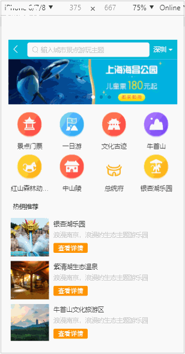

# travel

> 基于vue2.5开发的旅游网webApp部分功能<br>
> 技术栈：vuex, vue-router, vue-cli, es6， axios<br>
> 插件： vue-awesome-swiper, better-scroll, fastclick<br>
> css预处理器：stylus<br>
> 包管理工具： webpack

## Build Setup

``` bash
# install dependencies
npm install

# serve with hot reload at localhost:8080
npm run dev

# build for production with minification
npm run build

# build for production and view the bundle analyzer report
npm run build --report
```

For a detailed explanation on how things work, check out the [guide](http://vuejs-templates.github.io/webpack/) and [docs for vue-loader](http://vuejs.github.io/vue-loader).
### gif演示(首次加载，耗时较长，可以等一小会儿)

